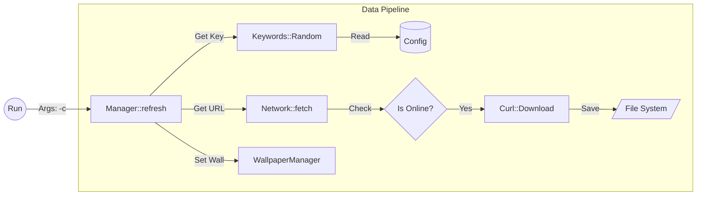
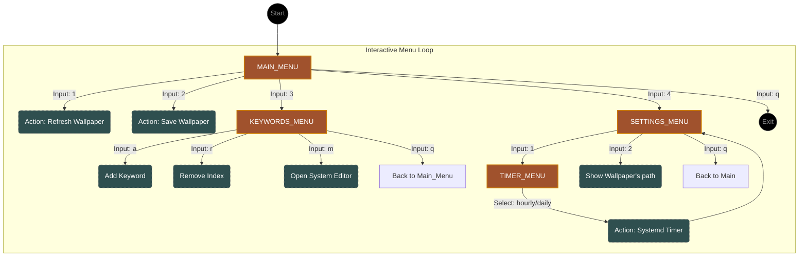

# 📘 Rwal – Technical Documentation

## 🧱 Architecture Overview

Rwal is built as a set of loosely coupled modules, each with a single responsibility. The main components are:

- **`AppController`** – Qt event loop entry point; manages `QSocketNotifier` for asynchronous input.
- **`Navigator`** – State machine for menu navigation; holds pointer to current `CharacterMenuConfig`.
- **`UIManager`** – Handles terminal output: line counting, clearing, coloured messages.
- **`NetworkManager`** – Wrapper around libcurl; performs HTTP requests and parses JSON responses.
- **`Keywords`** – Manages keyword lists: reading from config, random selection, editing via external editor.
- **`Settings`** – Configuration file handling, systemd timer integration, pictures path detection.
- **`WallpaperManager`** – Orchestrates wallpaper download and setting; saves images to user data directory.
- **`Logs`** – Simple file logger with size rotation and permission fixing.

### 📊Data Flow Graphs

#### Change Mode


*(Insert Mermaid code from `RwalPhilosophy.md`)*

#### Core Mode

*(Insert Mermaid code from `RwalPhilosophy.md`)*

## 📁 Detailed Module Breakdown

### `AppController`
- **Header:** `AppController.hpp`
- **Responsibilities:** Initializes `QSocketNotifier` for stdin, connects to `handleStdin` slot, prints initial menu.
- **Key methods:**
  - `AppController(Navigator* nav, QObject* parent = nullptr)` – constructor.
  - `void handleStdin()` – slot called when input is available; reads line, validates against current menu's `valid_choices`, processes input via `Navigator`, clears and prints updated menu.

### `Navigator`
- **Header:** `navigator.hpp`
- **Responsibilities:** Maintains current menu, processes input, handles menu transitions and quit.
- **Key members:**
  - `const CharacterMenuConfig* current_menu` – pointer to the active menu.
- **Key methods:**
  - `Navigator(const CharacterMenuConfig& config)` – initializes with starting menu.
  - `void printMenu()` – prints current menu lines.
  - `bool processInput(std::string input)` – calls `execute_actions` on current menu; updates menu or quits; returns `true` if quit requested.

### `CharacterMenuConfig` (defined in `menus.hpp`)
- **Purpose:** Defines a menu's behaviour.
- **Fields:**
  - `const std::string valid_choices` – string of allowed single‑character inputs.
  - `std::function<std::vector<std::string>()> menu_generator` – returns lines to display.
  - `std::function<MenuResponce(std::string)> logic_handler` – processes input and returns `MenuResponce`.
- **Methods:**
  - `MenuResponce execute_actions(std::string input) const` – calls `logic_handler`.
  - `std::vector<std::string> menu() const` – calls `menu_generator`.

### `MenuResponce` (in `menus.hpp`)
- **Fields:**
  - `const CharacterMenuConfig* nextMenu` – next menu to switch to (or `nullptr` to stay).
  - `bool IsWrongInput` – `true` if input was invalid.
  - `bool needQuit` – `true` if the program should quit.

### `UIManager`
- **Header:** `cli.hpp`
- **Purpose:** Manages terminal output: line counting, clearing, message display.
- **Key members:** `int count_ref` – number of lines printed since last clear.
- **Key methods:**
  - `static UIManager& getInstance()` – singleton access.
  - `void clear_last_lines()` – moves cursor up and clears `count_ref` lines.
  - `void countOperatorPlus(int count)` – adds to `count_ref`.
  - `void show_message(std::string message)` – prints message with colour based on content.
  - `void dodgeMessage(std::string message)` – adds message to "don't show again" list.
  - `template<typename T> T request_input(std::optional<std::string> message)` – reads input, optionally shows a prompt, retries on error.

### `NetworkManager`
- **Header:** `NetworkManager.hpp`
- **Purpose:** Handles HTTP requests, checks internet connectivity, downloads images.
- **Key members:** `MyCurl mycurl` – underlying CURL wrapper.
- **Key methods:**
  - `static NetworkManager& getInstance()` – singleton.
  - `bool isAvailable()` – checks internet by connecting
  - `std::string craftUrl(std::string keyword, std::optional<std::string> page)` – builds Wallhaven API URL.
  - `std::optional<std::string> fetchImage(std::string keyword)` – performs search, picks random page, downloads image; returns path or `nullopt` on failure.

### `MyCurl`
- **Header:** `CurlWrapper.hpp`
- **Purpose:** Low‑level CURL wrapper with JSON parsing.
- **Key methods:**
  - `MyCurl()` – initializes CURL; throws on failure.
  - `void getRequest(std::string url)` – performs GET request, stores response in `buffer`, parses JSON.
  - `std::string getData(std::string paragraph, std::string str)` – extracts string or int from parsed JSON.
  - `std::string downloadImage(const std::string& image_url)` – downloads image to `AppLocalDataLocation/downloads/`.

### `Keywords`
- **Header:** `keywords.hpp`
- **Purpose:** Keyword storage and retrieval.
- **Key methods:**
  - `std::vector<std::string> longWayGetKeywords()` – interactive input if config empty.
  - `void Default(std::vector<std::string>& keywords)` – sets default keyword list.
  - `std::string getRandomKeywords(const std::string& mode)` – returns random keyword; mode `"change"` uses `shortWayGetKeywords`, `"core"` uses `longWayGetKeywords`.
  - `void editKeywords()` – opens temporary file in `$EDITOR` for manual editing.
  - `template<typename T> T shortWayGetKeywords()` – returns keywords from config as vector or comma‑separated string.

### `Settings` (Timer & PicturesPath)
- **Headers:** `settings.hpp`, `settings.cpp`
- **`Timer` class:**
  - `std::optional<fs::path> getUserTimerPath() const` – gets `~/.config/systemd/user`.
  - `void createSystemdTimer()` – creates service and timer files if missing.
  - `std::string seeTimer()` – reads current timer value.
  - `std::string editTimer(std::string value)` – updates timer, (de)activates.
  - `bool checkTimerActiveStatus()` – checks if timer is active.
- **`PicturesPath` class:**
  - `fs::path getPicturesPath()` – returns `~/Pictures/rwal`, creating if needed.

### `Logs`
- **Header:** `logs.hpp`
- **Purpose:** File logging with rotation.
- **Key methods:**
  - `static Logs& getInstance()` – singleton.
  - `void writeLogs(std::string message)` – appends timestamped message to `~/.cache/rwal/logs.txt`.
  - `void refresh(fs::path& logs_path)` – deletes and recreates log file, fixing permissions.

## 🔧 Configuration File (`config.json`)

Located in `~/.config/Aloncie/rwal/config.json`. Structure:

```json
{
    "search": {
        "keywords": [
	        kewords for search
        ],
        "res": resolution wallpaper's,
        "sorting": type of sorting
    },
    "services": {
        "wallhaven": {
            "apikey": "YOUR_API_KEY_HERE",
            "base_url": "https://wallhaven.cc/api/v1/search",
            "param_names": {
                "query": "?q=",
                "res": "resolutions",
                "sorting": "sorting"
            }
        }
    }
}
```

## 🧪 Current Status & Roadmap
See ROADMAP.md for the up‑to‑date development plan.

## 🤝 Contributing
While this is a personal learning project, suggestions and bug reports are welcome via GitHub Issues.
