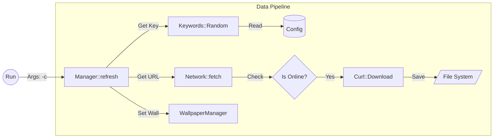
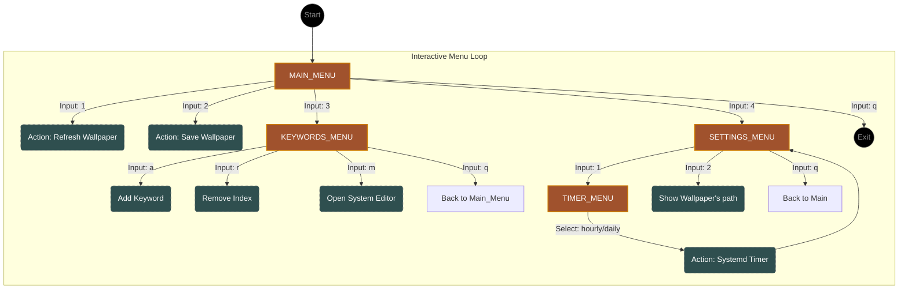

# 📊Flow Graphs

## ⚡Change Mode

```mermaid
graph LR
    %% Стиль: Слева направо (Linear)
    Start((Run)) -->|Args: -c| Refresh[Manager::refresh]
    
    subgraph Data_Flow [Data Pipeline]
        direction TB
        Refresh -->|Get Key| KW[Keywords::Random]
        KW -->|Read| Conf[(Config)]
        
        Refresh -->|Get URL| Net[Network::fetch]
        Net -->|Check| Avail{Is Online?}
        Avail -- Yes --> Curl[Curl::Download]
        Curl -->|Save| Disk[/File System/]
        
        Refresh -->|Set Wall| Set[WallpaperManager]
    end
```

## 🫂Core Mode

```mermaid
graph TD
    %% --- Dark Theme Styles ---
    classDef menu fill:#A0522D,stroke:#cc7a00,stroke-width:2px,color:#fff;
    classDef action fill:#2F4F4F,stroke:#808080,stroke-dasharray: 5 5,color:#fff;
    classDef startExit fill:#000,stroke:#555,color:#888;

    %% --- Nodes ---
    Start((Start)):::startExit --> Main[MAIN_MENU]
    
    subgraph Navigation [Interactive Menu Loop]
        direction TB
        Main:::menu
        
        %% Main Menu Logic
        Main -->|Input: 1| Refresh(Action: Refresh Wallpaper):::action
        Main -->|Input: 2| Save(Action: Save Wallpaper):::action
        Main -->|Input: 3| KW[KEYWORDS_MENU]:::menu
        Main -->|Input: 4| Sett[SETTINGS_MENU]:::menu
        Main -->|Input: q| Quit((Exit)):::startExit

        %% Keywords Menu Logic
        KW -->|Input: a| Add(Add Keyword):::action
        KW -->|Input: r| Remove(Remove Index):::action
        KW -->|Input: m| Editor(Open System Editor):::action
        KW -->|Input: q| BackKW[Back to Main_Menu] 

        %% Settings Menu Logic
        Sett -->|Input: 1| Timer[TIMER_MENU]:::menu
        Sett -->|Input: 2| Path(Show Wallpaper's path):::action
        Sett -->|Input: q| BackSett[Back to Main]

        %% Timer Menu Logic
        Timer -->|Select: hourly/daily| SetTimer(Action: Systemd Timer):::action --> Sett
    end

```
